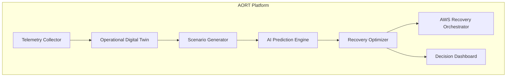
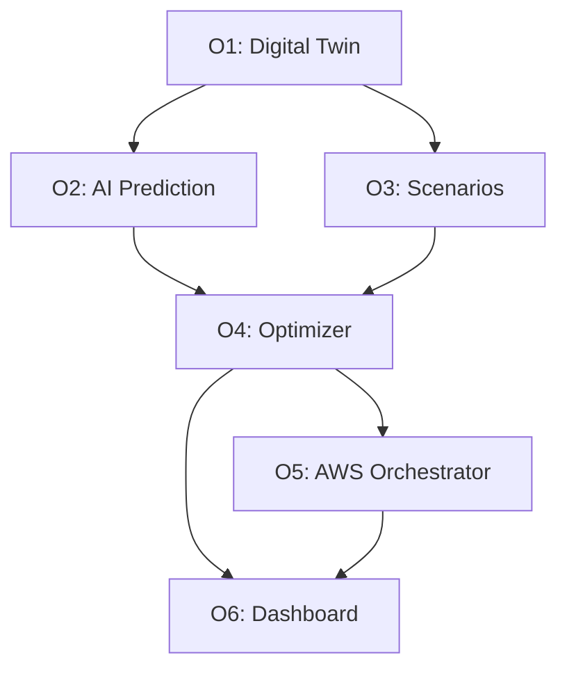
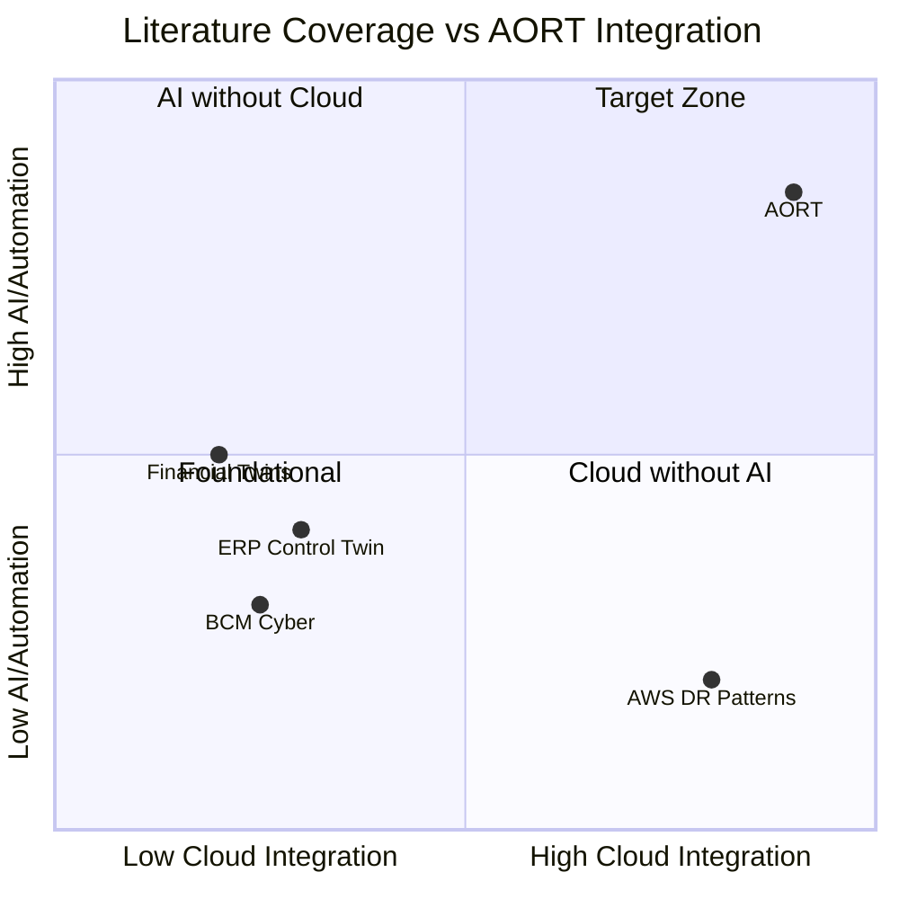
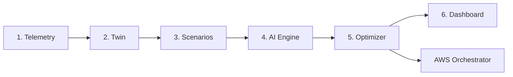
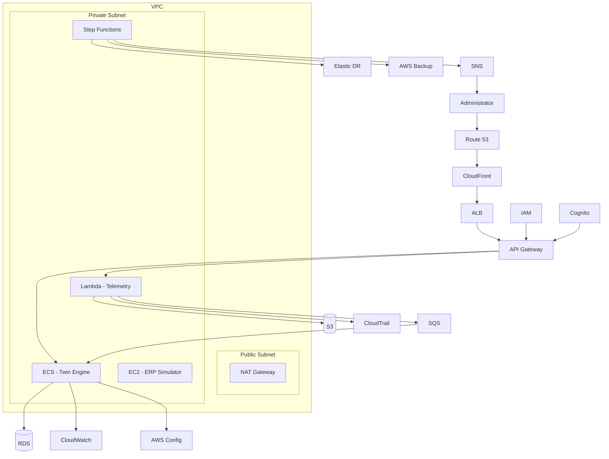
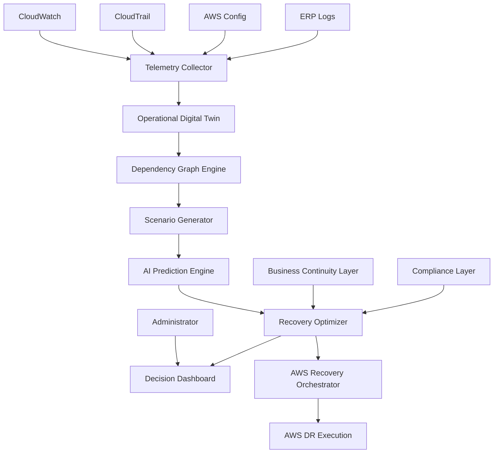
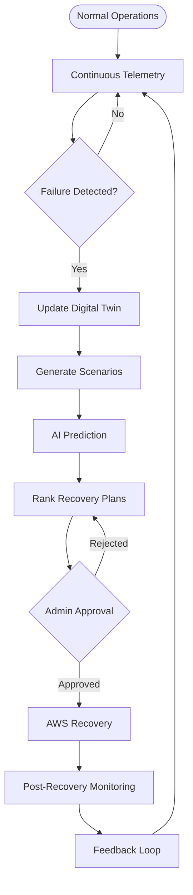
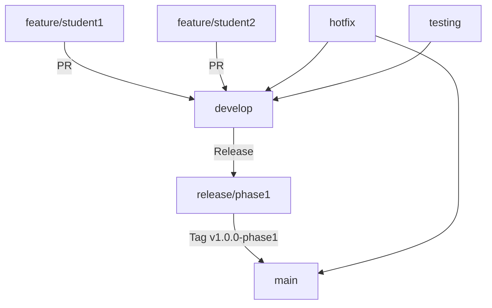
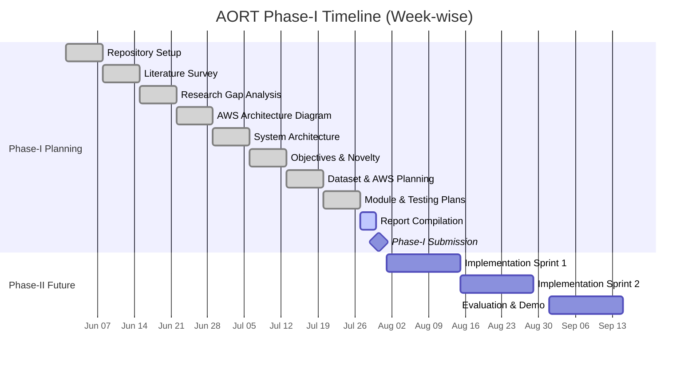

<div align="center">

# 🏦 AORT

### Autonomous Operational Recovery Twin

**An AI-Driven AWS Operational Digital Twin for Predictive Disaster Recovery Planning of Banking ERP Systems**

---

[](LICENSE)
[]()
[]()
[]()
[]()

*VIT University — Cloud Architecture Design — 2026*

[Overview](#-project-overview) •
[Architecture](#-architecture) •
[Documentation](#-repository-structure) •
[Team](#-team-members) •
[Timeline](#-project-timeline)

</div>

---

## 📋 Table of Contents

- [Project Overview](#-project-overview)
- [Abstract](#-abstract)
- [Problem Statement](#-problem-statement)
- [Motivation](#-motivation)
- [Objectives](#-objectives)
- [Novelty](#-novelty)
- [Research Gap](#-research-gap)
- [Expected Outcomes](#-expected-outcomes)
- [Scope](#-scope)
- [System Modules](#-system-modules)
- [Architecture](#-architecture)
- [Workflow](#-workflow)
- [AWS Services](#-aws-services)
- [Technology Stack](#-technology-stack)
- [Dataset](#-dataset)
- [Repository Structure](#-repository-structure)
- [Git Workflow](#-git-workflow)
- [Branch Strategy](#-branch-strategy)
- [Timeline](#-project-timeline)
- [Team Members](#-team-members)
- [Milestones](#-project-milestones)
- [Future Work](#-future-work)
- [License](#-license)
- [Acknowledgements](#-acknowledgements)
- [References](#-references)

---

## 🎯 Project Overview

**AORT (Autonomous Operational Recovery Twin)** is an academic research and architecture project that proposes an AI-driven AWS operational digital twin for **predictive disaster recovery planning** of banking ERP systems.

Phase-I delivers complete planning, architecture, literature survey, and documentation — **no implementation code**. The repository is structured for a professional engineering team to begin Phase-II development.



---

## 📄 Abstract

Banking ERP systems on AWS require disaster recovery that goes beyond static playbooks. Existing research fragments across financial stress testing, ERP control validation, business continuity management, and AWS resilience patterns — but no work unifies these into a banking-specific, AWS-native, predictive recovery framework.

AORT addresses this gap by maintaining a **live operational digital twin** fed by CloudWatch metrics, CloudTrail logs, AWS Config snapshots, and ERP telemetry. It simulates multi-hazard scenarios (ransomware, server failure, network outage, regional failure, transaction surge), predicts disruption propagation using AI, ranks recovery strategies by RTO/RPO/cost/compliance, and recommends AWS-native actions through a decision dashboard with administrator approval gates.

> Full abstract: [`docs/proposal/phase1-proposal.md`](docs/proposal/phase1-proposal.md)

---

## ❗ Problem Statement

| Challenge | Impact |
|-----------|--------|
| Reactive DR playbooks | Recovery begins after outage, increasing downtime |
| Fragmented observability | Cloud and ERP signals analyzed in isolation |
| Static RTO/RPO assumptions | No comparison of strategies under compound hazards |
| Manual failover decisions | Human bottleneck during critical incidents |
| Compliance requirements | Recovery actions must be explainable and auditable |

> Details: [`docs/problem-statement/problem-statement.md`](docs/problem-statement/problem-statement.md)

---

## 💡 Motivation

- Banking downtime impacts customer trust, regulatory compliance, and revenue
- AWS provides resilience primitives (EDR, multi-region, Step Functions) without intelligent strategy selection
- Combined literature gap analysis confirms no unified predictive DR framework for banking cloud ERP
- Digital twin and AI literature proves monitoring value — but not yet for banking DR optimization

---

## 🎯 Objectives

| # | Objective |
|---|-----------|
| O1 | Develop AWS-based operational digital twin mirroring banking infrastructure in near real time |
| O2 | Build AI prediction module for failure patterns using cloud telemetry and logs |
| O3 | Simulate ≥5 disaster scenarios: ransomware, server failure, network outage, regional failure, transaction surge |
| O4 | Rank recovery strategies using RTO, RPO, cost, availability, and business continuity impact |
| O5 | Integrate AWS-native recovery mechanisms for failover and restoration recommendations |
| O6 | Visualize resilience metrics and recovery actions through a decision dashboard |



> Details: [`docs/objectives/objectives.md`](docs/objectives/objectives.md)

---

## ✨ Novelty

AORT combines digital twin modeling, banking risk prediction, business continuity, and AWS DR into a **single predictive, decision-oriented framework**.

| Dimension | AORT Contribution |
|-----------|-------------------|
| New Feature | Predictive recovery planning vs reactive monitoring |
| Better Algorithm | AI-based recovery ranking vs fixed failover rules |
| Better Architecture | Layered twin: infrastructure + operations + policy |
| Better AWS Integration | Native observability and recovery execution |
| Better Security | Ransomware, compliance, and audit integration |
| Better Automation | Simulate, compare, recommend with approval gates |

> Details: [`docs/novelty/novelty-summary.md`](docs/novelty/novelty-summary.md)

---

## 🔬 Research Gap

The literature is fragmented across four groups:



**Gap Statement:** No existing work integrates financial/ERP modeling, BCM workflows, and AWS resilience into an adaptive banking digital twin that intelligently selects cloud recovery strategies under compound disruptions.

> Details: [`docs/research-gap/research-gap-summary.md`](docs/research-gap/research-gap-summary.md) | Literature: [`docs/literature-survey/literature-survey.md`](docs/literature-survey/literature-survey.md)

---

## 📊 Expected Outcomes

- AWS-native architecture for predictive banking disaster recovery
- 15-paper literature survey with individual gap analyses
- Synthetic dataset specification for twin and AI modules
- Six-module system design with workflow diagrams
- Six-sprint implementation roadmap for Phase-II
- Phase-I report and presentation materials

---

## 🔭 Scope

| Phase-I (Current) | Phase-II (Future) |
|-------------------|-------------------|
| Architecture & documentation | AWS deployment & implementation |
| Literature & gap analysis | ML model training & evaluation |
| Dataset planning (synthetic) | Live telemetry integration |
| GitHub repository & workflow | Production DR orchestration |

---

## 🧩 System Modules

| # | Module | Description |
|---|--------|-------------|
| 1 | **Telemetry Collector** | Ingests CloudWatch, CloudTrail, Config, ERP logs, backup metadata |
| 2 | **Operational Digital Twin** | Mirrors compute, storage, databases, APIs, ERP services, dependencies |
| 3 | **Scenario Generator** | Multi-hazard simulator: ransomware, crash, outage, region failure, surge |
| 4 | **AI Prediction Engine** | Forecasts disruption propagation, recovery difficulty, business impact |
| 5 | **Recovery Optimizer** | Scores and ranks candidate DR plans by RTO/RPO/cost/compliance |
| 6 | **Decision Dashboard** | Visualizes twin status, scenarios, rankings, and approval workflow |



---

## 🏗 Architecture

### Diagram 1 — AWS Cloud Architecture



> Full diagram: [`architecture/aws-architecture/aws-cloud-architecture.md`](architecture/aws-architecture/aws-cloud-architecture.md)

### Diagram 2 — Complete System Architecture



> Full diagram: [`architecture/system-architecture/system-architecture.md`](architecture/system-architecture/system-architecture.md)

---

## 🔄 Workflow

### End-to-End Recovery Workflow



> All workflows: [`architecture/workflow/project-workflows.md`](architecture/workflow/project-workflows.md)

---

## ☁️ AWS Services

| Service | Purpose |
|---------|---------|
| EC2, ECS, Lambda | Compute for twin, telemetry, ERP simulation |
| API Gateway, ALB, CloudFront, Route 53 | API and dashboard delivery |
| RDS, S3 | Twin state, logs, backups |
| CloudWatch, CloudTrail, Config | Observability and compliance |
| IAM, Cognito, KMS | Security and authentication |
| SNS, SQS, Step Functions | Notifications, queuing, orchestration |
| Elastic DR, AWS Backup | Disaster recovery execution |
| VPC | Network isolation |
| CloudFormation | Infrastructure as Code |

> Full table: [`documentation/aws/aws-services-table.md`](documentation/aws/aws-services-table.md)

---

## 🛠 Technology Stack

| Layer | Technologies (Phase-II) |
|-------|------------------------|
| **Cloud** | AWS (EC2, ECS, Lambda, RDS, S3, etc.) |
| **IaC** | AWS CloudFormation / Terraform |
| **Backend** | Python / Node.js (planned) |
| **Frontend** | React.js dashboard (planned) |
| **AI/ML** | Python, scikit-learn / SageMaker (planned) |
| **Data** | PostgreSQL (RDS), S3, Parquet |
| **CI/CD** | GitHub Actions (planned) |
| **Documentation** | Markdown, Mermaid |

---

## 📦 Dataset

| Dataset | Type | Purpose |
|---------|------|---------|
| Synthetic Banking ERP | Structured | ERP transaction simulation |
| CloudWatch Metrics | Time-series | Infrastructure health |
| CloudTrail Logs | Audit JSON | Security and API events |
| AWS Config Snapshots | Configuration | Compliance drift |
| Disaster Scenarios | JSON profiles | Multi-hazard simulation |

> Details: [`dataset/dataset-description.md`](dataset/dataset-description.md)

---

## 📁 Repository Structure

```
AORT_Cloud_Project_2026/
├── README.md
├── LICENSE
├── CHANGELOG.md
├── CONTRIBUTING.md
├── CODE_OF_CONDUCT.md
├── SECURITY.md
├── docs/
│   ├── literature-survey/
│   ├── research-gap/
│   ├── proposal/
│   ├── objectives/
│   ├── novelty/
│   ├── problem-statement/
│   ├── implementation-plan/
│   ├── weekly-progress/
│   └── meeting-notes/
├── architecture/
│   ├── aws-architecture/
│   ├── system-architecture/
│   ├── workflow/
│   ├── sequence-diagrams/
│   ├── deployment/
│   └── diagrams-source/
├── dataset/
│   ├── raw/
│   ├── processed/
│   └── synthetic/
├── documentation/
│   ├── frontend/
│   ├── backend/
│   ├── ai-model/
│   ├── aws/
│   └── database/
├── testing/
│   ├── unit/
│   ├── integration/
│   └── simulation/
├── reports/
├── results/
├── presentation/
├── github/
│   ├── branch-strategy/
│   ├── pull-request-template/
│   ├── issue-template/
│   ├── project-board/
│   └── milestones/
└── scripts/
    └── placeholder/
```

---

## 🔀 Git Workflow



### Rules
1. Never commit directly to `main`
2. Each student works on their `feature/studentX` branch
3. PR to `develop` with peer review
4. Release via `release/phase1` → `main` with tags

> Full workflow: [`github/branch-strategy/git-workflow.md`](github/branch-strategy/git-workflow.md)

---

## 🌿 Branch Strategy

| Branch | Purpose |
|--------|---------|
| `main` | Production-ready releases (tagged) |
| `develop` | Integration branch |
| `feature/student1` | Student 1 — AWS, twin, docs, papers 1–8 |
| `feature/student2` | Student 2 — AI, dataset, papers 9–15 |
| `testing` | Integration test validation |
| `release/phase1` | Phase-I submission freeze |
| `hotfix` | Urgent documentation fixes |

---

## 📅 Project Timeline



> Sprint details: [`docs/implementation-plan/sprint-plan.md`](docs/implementation-plan/sprint-plan.md)

---

## 👥 Team Members

| Member | Branch | Responsibilities |
|--------|--------|------------------|
| **Student 1** | `feature/student1` | AWS Architecture, Digital Twin, Cloud Infrastructure, GitHub Setup, Documentation, Frontend Planning, Literature Papers 1–8, Research Gap, Architecture Diagrams |
| **Student 2** | `feature/student2` | AI Engine, Recovery Optimizer, Scenario Generator, Backend Planning, Dataset Planning, Testing Planning, Literature Papers 9–15, Novelty, Evaluation Metrics, Presentation |

### Shared Responsibilities (Both)
- Documentation review and maintenance
- Testing planning
- Presentation preparation
- Weekly meetings and progress logs
- GitHub PR reviews
- Architecture discussions

### Contribution Matrix

| Activity | Student 1 | Student 2 |
|----------|:---------:|:---------:|
| Literature Survey | ✓ (1–8) | ✓ (9–15) |
| Research Gap | ✓ | ✓ |
| AWS Architecture | ✓ | |
| System Architecture | ✓ | ✓ |
| AI / Optimizer Planning | | ✓ |
| Dataset Documentation | | ✓ |
| GitHub & Branch Strategy | ✓ | |
| Documentation | ✓ | ✓ |
| Presentation | ✓ | ✓ |
| GitHub Commits (20–30) | ✓ | ✓ |
| Pull Requests (≥2) | ✓ | ✓ |

---

## 🏁 Project Milestones

| Milestone | Status |
|-----------|--------|
| M1: Repository setup | ✅ |
| M2: Literature survey (15 papers) | ✅ |
| M3: Research gap analysis | ✅ |
| M4: AWS Architecture (Diagram 1) | ✅ |
| M5: System Architecture (Diagram 2) | ✅ |
| M6: Objectives & novelty | ✅ |
| M7: Dataset & AWS planning | ✅ |
| M8: Workflow diagrams | ✅ |
| M9: Testing plans | ✅ |
| M10: Phase-I submission | 🔄 |
| M11: Tag `v1.0.0-phase1` | 🔄 |

> Details: [`github/milestones/phase1-milestones.md`](github/milestones/phase1-milestones.md)

---

## 🔮 Future Work

- **Phase-II:** Full AWS deployment and module implementation
- **SageMaker:** ML model training for disruption prediction
- **Chaos Engineering:** Game day integration with optimizer feedback
- **Multi-Region:** Active-active banking DR demonstration
- **Compliance Automation:** RBI and PCI-DSS aligned audit trails
- **DR-as-a-Service:** Multi-tenant extension for banking institutions

---

## 📜 License

This project is licensed under the **MIT License** — see [LICENSE](LICENSE) for details.

---

## 🙏 Acknowledgements

- **Dr. Priya V** — Course Instructor, BCSE355L Cloud Architecture Design, VIT University
- **AWS** — Well-Architected Framework, FSI Industry Lens, and EV Digital Twin reference architecture
- Research authors cited in the literature survey (15 papers, 2023–2026)

---

## 📚 References

1. Pattabhi, A. (2025). *Financial Digital Twins: AI and Simulation-Based Risk Management for Banking Systems.* IJAIDSML.
2. Metha, S., et al. (2025). *Stress Testing Financial Systems — Simulating Economic Disruption Using AI-driven Risk Models.* IJCESEN.
3. Saadhu (2026). *Digital Twin-Enabled Stress Testing of Financial Controls in ERP Environments.* IJISAE.
4. van den Berg, R. (2024). *Utilizing a Digital Model to Support BCM Processes and Enhance Cyber Resilience.* UT Twente.
5. Coiciu, I. & Militaru, G. (2024). *Improvement of Cyber Resilience by Implementation of a Digital BCM System.* PICBE.
6. Ponnusamy (2025). *Enhancing Banking Disaster Recovery with AWS Cloud Services.* IJSSRG.
7. AWS (2026). *Financial Services Industry Lens: Resilience Architecture.* AWS Documentation.
8. AWS / Capital One (2024). *Capital One's Cloud Resiliency Strategies.* AWS Case Study.
9. Shah, D.P. (2025). *Real-World Implementation of Disaster Recovery in AWS.* IJIRT.
10. AWS (2026). *Disaster Recovery of Workloads on AWS.* AWS Well-Architected Framework.
11. AWS (2026). *EV Digital Twin with AI-Powered Operational Monitoring.* AWS Solutions Library.

> Full bibliography: [`docs/literature-survey/literature-survey.md`](docs/literature-survey/literature-survey.md)

---

<div align="center">

**AORT_Cloud_Project_2026** — Phase-I Planning Repository

*Predictive • Automated • Resilience-Oriented*

</div>
