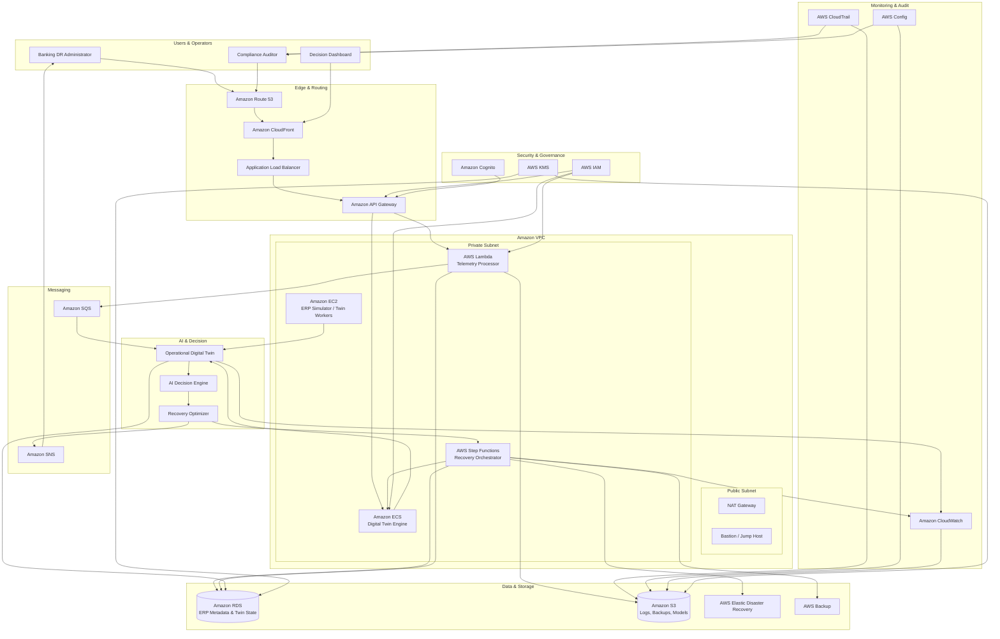
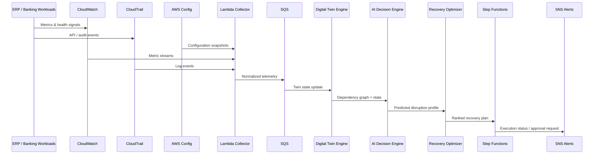
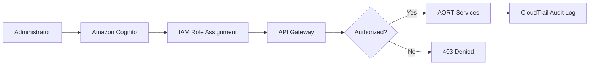

# AWS Cloud Architecture — Diagram 1

> **Reference:** [AWS EV Digital Twin with AI-Powered Operational Monitoring](https://docs.aws.amazon.com/solutions/latest/ev-digital-twin-on-aws/solution-overview.html)  
> **Phase-I:** Planning architecture — no infrastructure deployed

## Architecture Overview

This diagram shows how AWS services interact to support AORT's telemetry ingestion, digital twin engine, AI decision engine, recovery orchestration, monitoring, security, and notifications.

---

## Data Flow

---

## Service Responsibilities

| Layer | AWS Services | Responsibility |
|-------|-------------|----------------|
| **Ingress** | Route 53, CloudFront, ALB, API Gateway | Secure user access, API routing, dashboard delivery |
| **Compute** | ECS, EC2, Lambda | Twin engine, telemetry processing, ERP simulation |
| **Orchestration** | Step Functions, SQS | Recovery workflow execution, async telemetry pipeline |
| **Data** | RDS, S3, Backup, Elastic DR | Twin state, logs, backups, cross-region recovery |
| **AI** | Lambda + ECS (SageMaker Phase-II) | Prediction and recovery optimization |
| **Security** | IAM, Cognito, KMS | Authentication, authorization, encryption |
| **Observability** | CloudWatch, CloudTrail, Config | Monitoring, audit, compliance evidence |
| **Notifications** | SNS | Alerts to administrators |

---

## Authentication Flow

---

## Subnet Design

| Subnet | Resources | Rationale |
|--------|-----------|-----------|
| **Public** | ALB, NAT Gateway, Bastion | Internet-facing entry; controlled admin access |
| **Private** | ECS, EC2, Lambda, RDS, Twin Engine | No direct internet; defense in depth |

---

## Multi-Region Consideration

Primary region hosts active twin and ERP simulator. Secondary region holds EDR replicas and warm standby resources for regional failure scenarios (Phase-II).
