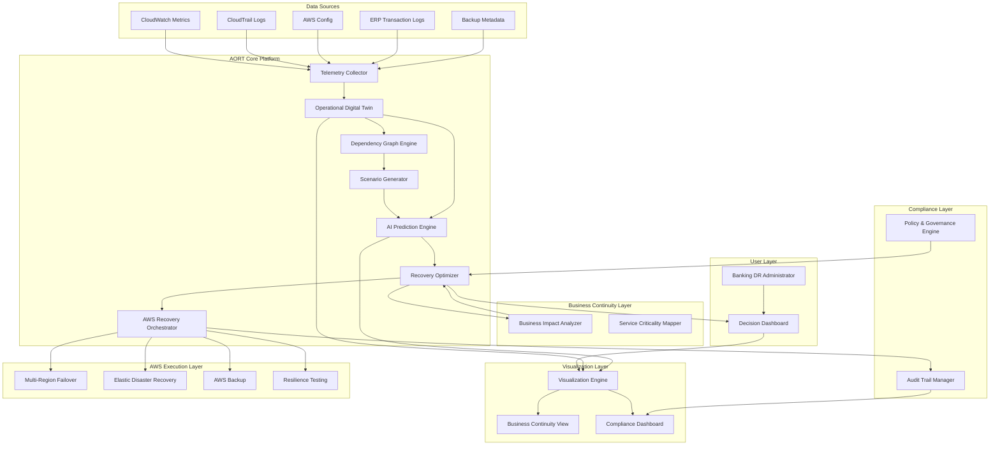
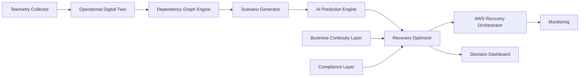
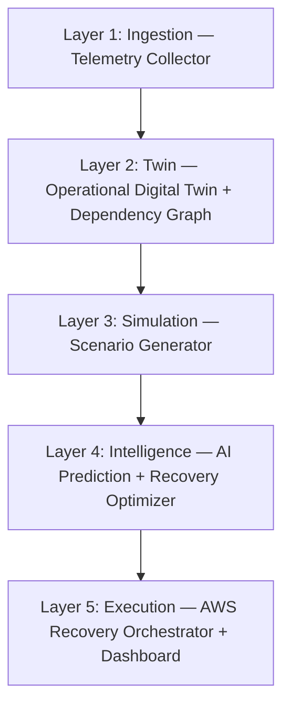

# Complete System Architecture — Diagram 2

> **Phase-I:** Conceptual system architecture for AORT modules and workflows

## System Architecture Diagram

---

## Module Descriptions

### 1. Telemetry Collector
**Purpose:** Ingests AWS and ERP observability data into a unified pipeline.

| Input | Output |
|-------|--------|
| CloudWatch metrics, CloudTrail logs, Config snapshots, ERP logs, backup metadata | Normalized telemetry events to Operational Digital Twin |

**AWS Services:** Lambda, SQS, S3, Kinesis (Phase-II optional)

---

### 2. Operational Digital Twin
**Purpose:** Maintains a near-real-time mirror of banking infrastructure, ERP services, databases, APIs, and dependency links.

| Input | Output |
|-------|--------|
| Normalized telemetry, dependency definitions | Current system state graph, health posture, replication lag |

**Key Concept:** Not a static simulation artifact — a continuously updated **decision substrate**.

---

### 3. Dependency Graph Engine
**Purpose:** Models service topology — compute, storage, databases, APIs, identity controls, and cross-region dependencies.

| Input | Output |
|-------|--------|
| Twin state, service registry, ERP process maps | Directed dependency graph with criticality weights |

---

### 4. Scenario Generator (Multi-Hazard Simulator)
**Purpose:** Generates compound disruption scenarios for stress testing recovery strategies.

| Scenario Type | Description |
|---------------|-------------|
| Ransomware | Encryption of critical data stores |
| Server crash | EC2/ECS task failure |
| Network outage | VPC/subnet connectivity loss |
| Regional failure | Full AZ/region unavailability |
| Transaction surge | Abnormal ERP load spike |
| Insider threat | Unauthorized config changes |

---

### 5. AI Prediction Engine
**Purpose:** Forecasts disruption propagation, recovery difficulty, and business impact.

| Input | Output |
|-------|--------|
| Twin state, scenario parameters, historical patterns | Failure probability, propagation path, estimated RTO/RPO impact |

**Methods (Phase-II):** Anomaly detection, time-series forecasting, graph-based propagation models

---

### 6. Recovery Optimizer
**Purpose:** Scores and ranks candidate recovery strategies.

| Metrics | Weight Factor |
|---------|---------------|
| RTO | Time to restore service |
| RPO | Acceptable data loss |
| Cost | Infrastructure and failover cost |
| Availability | Service uptime impact |
| Business Impact | Customer-facing service disruption |
| Compliance | Regulatory and audit constraints |

**Output:** Ranked recovery plans with explainable justification

---

### 7. AWS Recovery Orchestrator
**Purpose:** Maps selected recovery strategy to executable AWS actions.

| Strategy | AWS Pattern |
|----------|-------------|
| Backup & Restore | S3 + RDS snapshot restore |
| Pilot Light | Minimal standby + scale-up |
| Warm Standby | Reduced-capacity active secondary |
| Active/Active | Multi-region Route 53 failover |
| EDR Failover | Elastic Disaster Recovery launch |

**Orchestration:** AWS Step Functions with administrator approval gates

---

### 8. Decision Dashboard
**Purpose:** Unified console for twin status, predictions, scenarios, rankings, and approval workflow.

**Views:** Twin health, scenario outcomes, recovery recommendations, compliance status

---

### 9. Business Continuity Layer
**Purpose:** Links technical incidents to customer-facing banking services and ERP transaction flows.

**Components:** Business Impact Analyzer, Service Criticality Mapper

---

### 10. Compliance Layer
**Purpose:** Ensures recovery decisions meet governance, auditability, encryption, and regulatory requirements.

**Components:** Audit Trail Manager, Policy & Governance Engine

---

## Component Interaction Diagram

---

## Layered Architecture (Five Layers)

