# Project Workflows — AORT

## 1. Normal Operation Workflow

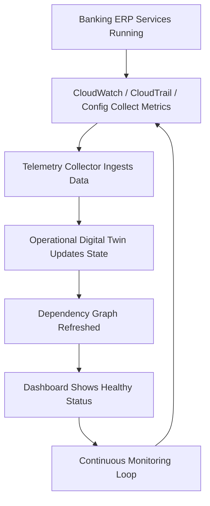

---

## 2. Failure Detection Workflow

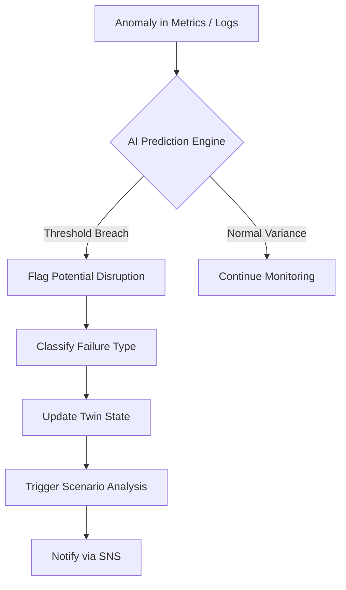

---

## 3. Telemetry Collection Workflow

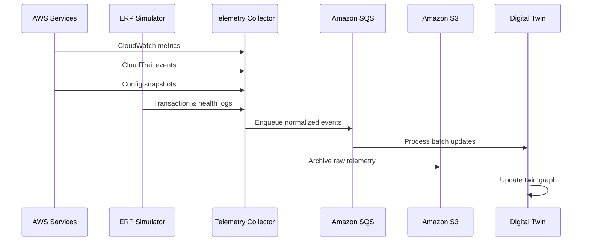

---

## 4. Digital Twin Synchronization Workflow

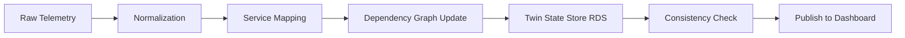

---

## 5. Scenario Generation Workflow

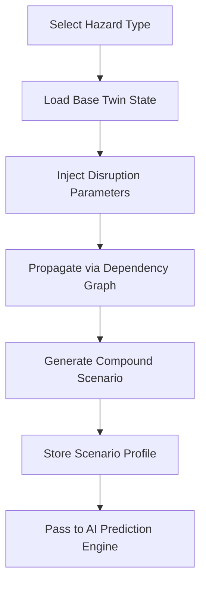

**Supported Scenarios:** Ransomware, server crash, network outage, regional failure, transaction surge, insider/config drift

---

## 6. AI Prediction Workflow

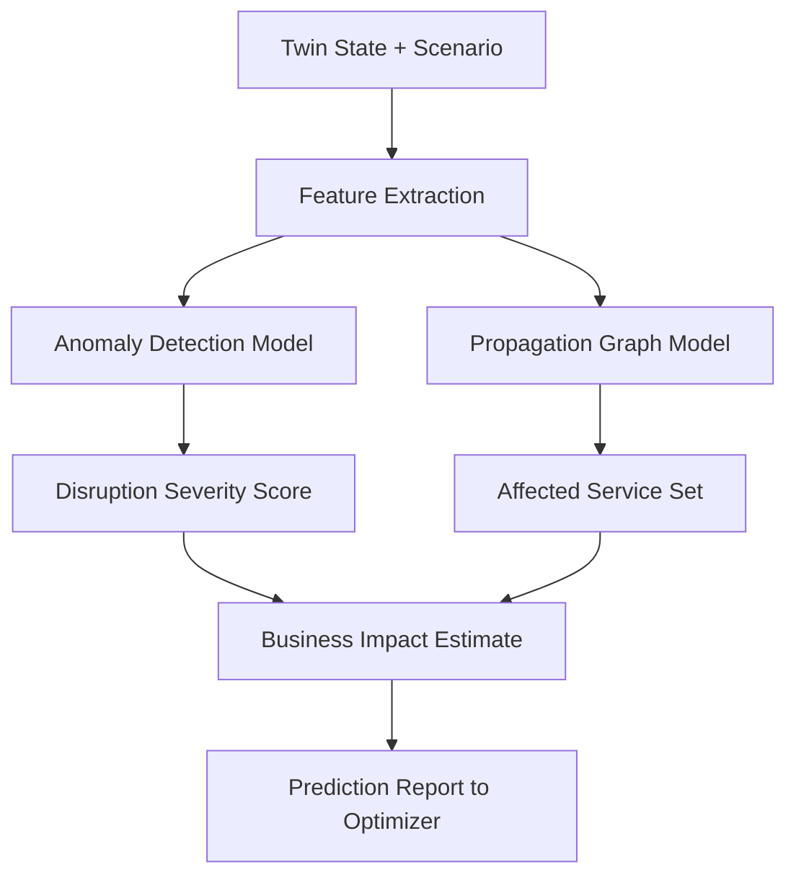

---

## 7. Recovery Optimization Workflow

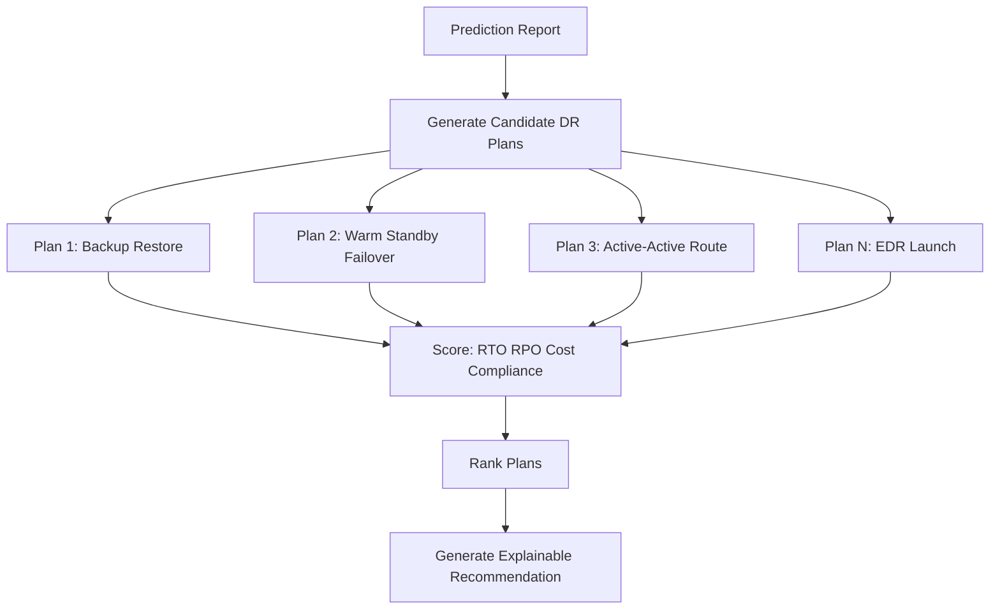

---

## 8. Recommendation & Administrator Approval Workflow

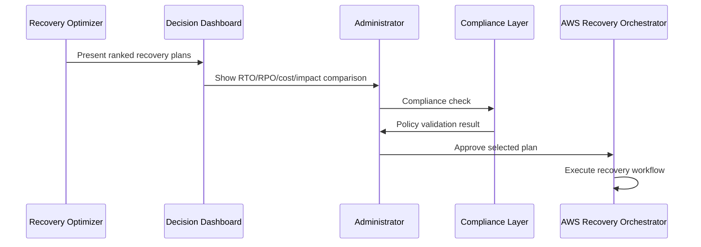

---

## 9. AWS Recovery Execution Workflow

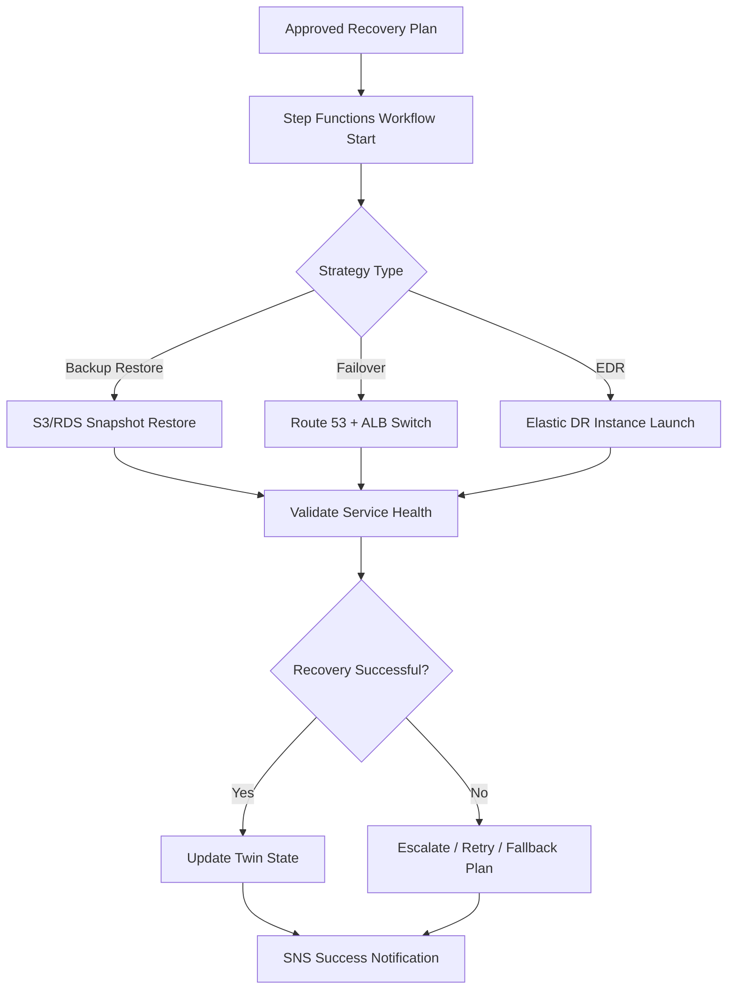

---

## 10. Post-Recovery Monitoring Workflow

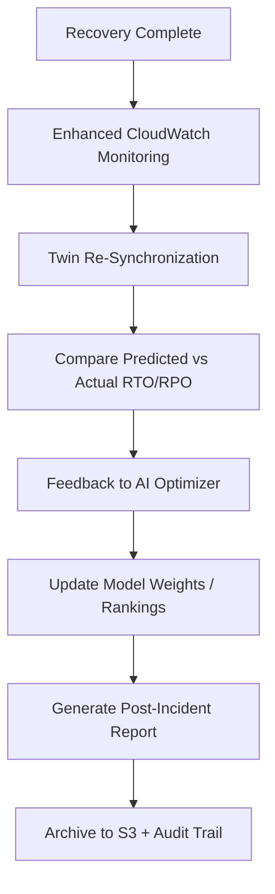

---

## End-to-End Master Workflow

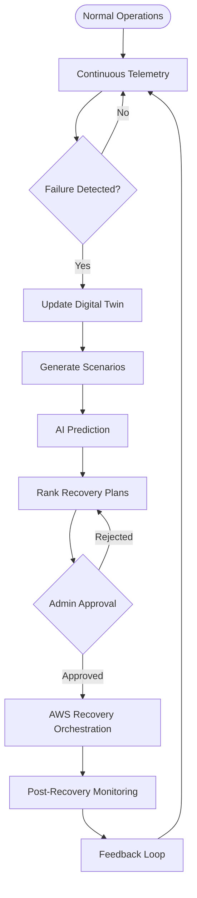
