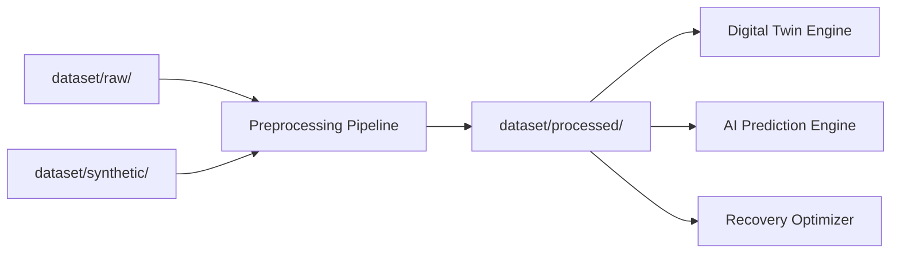

# Dataset Documentation — AORT

> **Phase-I:** Synthetic and publicly available AWS telemetry patterns only. No real banking customer data.

## Dataset Overview

| Dataset Name | Source | Type | License |
|--------------|--------|------|---------|
| Synthetic Banking ERP Dataset | Generated (Phase-II) | Structured JSON/CSV | Academic use / MIT |
| CloudWatch Metrics Export | AWS CloudWatch (simulated) | Time-series metrics | AWS Customer Agreement |
| CloudTrail Log Samples | AWS CloudTrail (simulated) | JSON audit logs | AWS Customer Agreement |
| AWS Config Snapshots | AWS Config (simulated) | JSON configuration | AWS Customer Agreement |
| ERP Transaction Logs | ERP Simulator (synthetic) | Structured logs | Academic use |
| Backup Metadata | AWS Backup / S3 (simulated) | JSON metadata | Academic use |
| Recovery Execution Logs | Step Functions (simulated) | Workflow logs | Academic use |
| Disaster Scenario Profiles | Scenario Generator output | JSON profiles | Academic use |

---

## 1. Synthetic Banking ERP Dataset

| Attribute | Value |
|-----------|-------|
| **Purpose** | Simulate banking ERP workloads, transaction flows, and service dependencies |
| **Expected Size** | ~500 MB (raw), ~50 MB (processed) |
| **Records** | ~2,000,000 synthetic transactions |
| **Features** | `transaction_id`, `account_id`, `service_id`, `amount`, `timestamp`, `status`, `region`, `latency_ms`, `dependency_chain` |
| **Data Type** | Structured (JSON, CSV, Parquet) |
| **Preprocessing** | Normalization, anonymization (synthetic by design), feature extraction for twin graph |

---

## 2. CloudWatch Metrics

| Attribute | Value |
|-----------|-------|
| **Purpose** | Infrastructure health, CPU/memory/network, custom ERP metrics |
| **Expected Size** | ~200 MB per simulation week |
| **Records** | ~5,000,000 metric data points |
| **Features** | `namespace`, `metric_name`, `dimensions`, `timestamp`, `value`, `unit`, `statistic` |
| **Data Type** | Time-series |
| **Preprocessing** | Resampling, aggregation (1-min/5-min), anomaly labeling |

---

## 3. CloudTrail Logs

| Attribute | Value |
|-----------|-------|
| **Purpose** | API audit trail, security events, configuration changes |
| **Expected Size** | ~100 MB per simulation week |
| **Records** | ~500,000 events |
| **Features** | `eventTime`, `eventSource`, `eventName`, `userIdentity`, `sourceIPAddress`, `requestParameters`, `responseElements` |
| **Data Type** | JSON (newline-delimited) |
| **Preprocessing** | Parsing, filtering security-relevant events, insider-threat labeling |

---

## 4. AWS Config Snapshots

| Attribute | Value |
|-----------|-------|
| **Purpose** | Resource configuration state, compliance drift detection |
| **Expected Size** | ~50 MB |
| **Records** | ~10,000 configuration items |
| **Features** | `resourceType`, `resourceId`, `configuration`, `complianceType`, `captureTime` |
| **Data Type** | JSON |
| **Preprocessing** | Diff computation between snapshots, drift feature extraction |

---

## 5. ERP Transaction Logs

| Attribute | Value |
|-----------|-------|
| **Purpose** | Business-process level observability for twin synchronization |
| **Expected Size** | ~300 MB |
| **Records** | ~1,000,000 log entries |
| **Features** | `log_level`, `service`, `operation`, `duration_ms`, `correlation_id`, `error_code` |
| **Data Type** | Structured logs |
| **Preprocessing** | Log parsing, correlation ID linking, error classification |

---

## 6. Backup Metadata

| Attribute | Value |
|-----------|-------|
| **Purpose** | Recovery point availability, backup freshness for RPO calculation |
| **Expected Size** | ~10 MB |
| **Records** | ~5,000 backup job records |
| **Features** | `backup_job_id`, `resource_arn`, `completion_date`, `backup_size`, `status`, `vault_name` |
| **Data Type** | JSON |
| **Preprocessing** | RPO window calculation, backup health scoring |

---

## 7. Recovery Execution Logs

| Attribute | Value |
|-----------|-------|
| **Purpose** | Training feedback for recovery optimizer; post-incident analysis |
| **Expected Size** | ~20 MB |
| **Records** | ~1,000 recovery workflows |
| **Features** | `workflow_id`, `strategy`, `start_time`, `end_time`, `actual_rto`, `actual_rpo`, `success`, `cost` |
| **Data Type** | JSON |
| **Preprocessing** | Outcome labeling, strategy performance aggregation |

---

## 8. Disaster Scenario Profiles

| Attribute | Value |
|-----------|-------|
| **Purpose** | Multi-hazard simulation inputs for scenario generator |
| **Expected Size** | ~5 MB |
| **Records** | 50+ scenario profiles (5+ hazard types × variants) |
| **Features** | `scenario_id`, `hazard_type`, `severity`, `affected_services`, `cascade_rules`, `duration` |
| **Data Type** | JSON |
| **Preprocessing** | Validation against dependency graph, compound scenario composition |

---

## Dataset Pipeline



---

## Directory Structure

```
dataset/
├── raw/           # Unprocessed exports
├── processed/     # Feature-ready datasets
└── synthetic/     # Generated ERP & scenario data
```

## Privacy & Compliance

- All data is **synthetic** or **simulated** — no real PII or banking customer data
- Dataset adheres to academic research ethics
- Phase-II will document data generation scripts in `scripts/` (not Phase-I)
