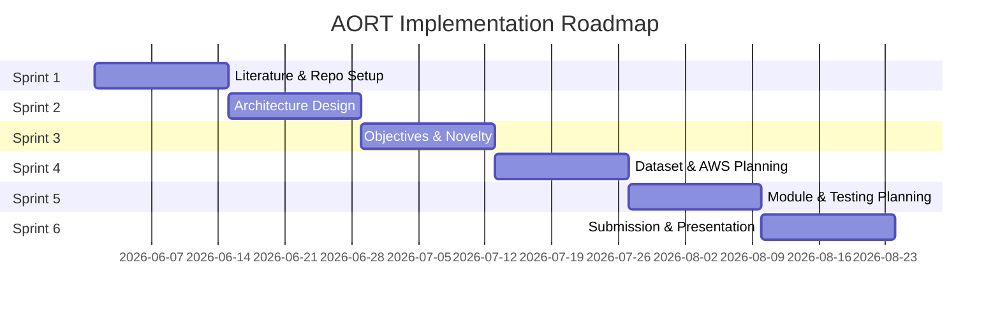
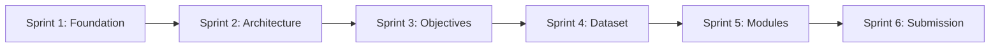

# Implementation Roadmap — Sprint Plan

> **6 Sprints** for Phase-I planning through Phase-II implementation transition

---

## Sprint 1: Foundation & Literature (Weeks 1–2)

| Item | Detail |
|------|--------|
| **Goal** | Establish repository, complete literature survey, and define research gaps |
| **Deliverables** | GitHub repo, branch strategy, literature survey (15 papers), individual gap analyses |
| **Milestones** | Repo live; papers 1–15 catalogued; gap summary approved |
| **Risks** | Paper access delays; inconsistent gap analysis quality |
| **Outputs** | `docs/literature-survey/`, `docs/research-gap/`, `github/branch-strategy/` |

---

## Sprint 2: Architecture Design (Weeks 3–4)

| Item | Detail |
|------|--------|
| **Goal** | Complete AWS Cloud Architecture and System Architecture diagrams |
| **Deliverables** | Diagram 1 (AWS), Diagram 2 (System), workflow diagrams, module descriptions |
| **Milestones** | Both mandatory architecture diagrams reviewed and approved |
| **Risks** | Over-complex architecture; misalignment with AWS best practices |
| **Outputs** | `architecture/aws-architecture/`, `architecture/system-architecture/`, `architecture/workflow/` |

---

## Sprint 3: Objectives, Novelty & Proposal (Weeks 5–6)

| Item | Detail |
|------|--------|
| **Goal** | Finalize objectives, novelty summary, problem statement, and Phase-I proposal |
| **Deliverables** | Objectives doc, novelty summary, abstract, proposal draft |
| **Milestones** | 4–6 measurable objectives; one-page novelty; 200–300 word abstract |
| **Risks** | Objectives too broad for academic scope |
| **Outputs** | `docs/objectives/`, `docs/novelty/`, `docs/problem-statement/`, `docs/proposal/` |

---

## Sprint 4: Dataset & AWS Planning (Weeks 7–8)

| Item | Detail |
|------|--------|
| **Goal** | Define datasets, AWS service mapping, and preprocessing pipeline |
| **Deliverables** | Dataset documentation, AWS services table, synthetic data schema |
| **Milestones** | All 8 dataset types documented with attributes and sizes |
| **Risks** | Unrealistic dataset size estimates; missing preprocessing steps |
| **Outputs** | `dataset/`, `documentation/aws/`, `documentation/database/` |

---

## Sprint 5: Module Planning & Testing Strategy (Weeks 9–10)

| Item | Detail |
|------|--------|
| **Goal** | Detailed planning for all 6 AORT modules and testing approach |
| **Deliverables** | Frontend/backend/AI planning docs, unit/integration/simulation test plans |
| **Milestones** | All 6 modules have input/output specs; test plans for each layer |
| **Risks** | Module interfaces undefined; testing scope creep |
| **Outputs** | `documentation/frontend/`, `documentation/backend/`, `documentation/ai-model/`, `testing/` |

---

## Sprint 6: Phase-I Submission & Presentation (Weeks 11–12)

| Item | Detail |
|------|--------|
| **Goal** | Compile Phase-I report, finalize README, prepare presentation, tag release |
| **Deliverables** | Phase-I report PDF, presentation slides, `v1.0.0-phase1` tag |
| **Milestones** | All guidelines met; GitHub activity targets achieved; review-ready |
| **Risks** | Last-minute merge conflicts; incomplete individual contributions |
| **Outputs** | `reports/`, `presentation/`, release tag on `main` |

---

## Sprint Timeline

---

## Sprint Dependency Graph

