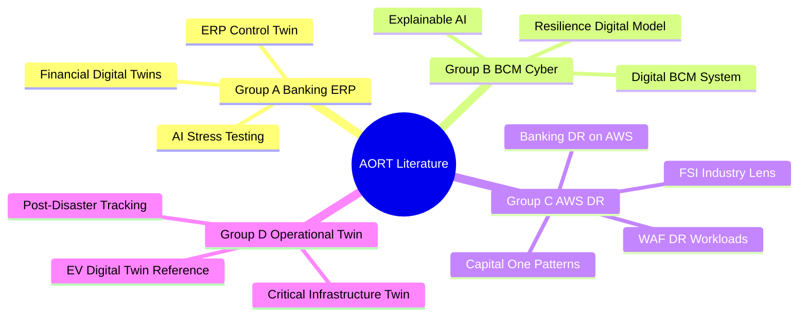

# Literature Survey — AORT Project

> **Course:** BCSE355L — Cloud Architecture Design  
> **Instructor:** Dr. Priya V  
> **Team Size:** 2 members | **Total Papers:** 15  
> **Preferred Venues:** IEEE, Springer, Elsevier, ACM, Wiley, MDPI, Nature (Scopus-indexed)  
> **Publication Window:** 2023–2026 (preferred)

## Distribution

| Student | Papers | Focus Area |
|---------|--------|------------|
| Student 1 | 1–8 | Banking risk, ERP, BCM, AWS DR foundations |
| Student 2 | 9–15 | AWS DR practice, digital twin operations, critical infrastructure, evaluation |

---

## Literature Survey Table

| # | Paper (Author, Title, Year) | Method | Dataset / Environment | Advantages | Limitations | Research Gap |
|---|----------------------------|--------|----------------------|------------|-------------|--------------|
| 1 | Pattabhi, *Financial Digital Twins: AI and Simulation-Based Risk Management for Banking Systems* (2025), IJAIDSML | Literature review; AI/ML, Monte Carlo, agent-based modeling, scenario analysis | Banking systems; market/credit risk, fraud, compliance | Strong financial digital twin and stress-testing foundation | No AWS cloud ops, failover, ERP dependency mapping, or DR orchestration | Financial twin stops at risk simulation; no cloud-native recovery decisions |
| 2 | Metha et al., *Stress Testing Financial Systems — Simulating Economic Disruption Using AI-driven Risk Models* (2025), IJCESEN | LSTM, GAN, XGBoost, DRL; dynamic scenario generation; real-time monitoring | Macro/geopolitical/climate/cyber/ESG signals | Strong predictive scenario generation and early warning | No infrastructure recovery, AWS orchestration, or ERP restoration | Predictive modeling exists without ranked recovery actions |
| 3 | Saadhu, *Digital Twin-Enabled Stress Testing of Financial Controls in ERP Environments* (2026), IJISAE | ERP digital twin; control modeling, backtesting, calibration, stress scenarios | ERP controls, transaction flows, authorization hierarchies | Closest fit to ERP-finance; strong control validation | No AWS multi-region failover or autonomous orchestration | ERP stress covered; cloud DR optimization missing |
| 4 | van den Berg, *Utilizing a Digital Model to Support BCM Processes and Enhance Cyber Resilience* (2024), UT Twente | Design study; Resilience Digital Model Architecture; BIA, DR testing | BCM / cyber resilience; IT interdependencies | Continuity modeling, interdependency visibility, DR testing | Conceptual; not AI-driven or AWS-native | Recovery treated procedurally, not as optimization |
| 5 | Coiciu & Militaru, *Improvement of Cyber Resilience by Implementation of a Digital BCM System* (2024), PICBE/Sciendo | BCM software; ransomware simulation; crisis workflow | Organizational BCM; ransomware disruption | Practical digitized BCM and recovery planning evidence | Not predictive; no multi-strategy AWS optimization | Cyber resilience digitized without intelligent plan selection |
| 6 | Ponnusamy, *Enhancing Banking Disaster Recovery with AWS Cloud Services* (2025), IJSSRG | Descriptive analysis of EC2, S3, RDS, Elastic DR; DR pattern comparison | Banking DR on AWS | Strong AWS-native DR service mapping | Infrastructure focus; no AI decision engine | AWS building blocks without adaptive strategy selection |
| 7 | AWS, *Financial Services Industry Lens: Resilience Architecture* (2026), AWS Docs | Architecture guidance; dependency decoupling, failover readiness | AWS financial services workloads | Validated resiliency, compliance, auditability patterns | Guidance only; not adaptive twin system | Best practices known but not integrated into predictive recovery |
| 8 | AWS / Capital One, *Capital One's Cloud Resiliency Strategies* (2024), AWS Video/Case Study | Multi-region failover, active/active, cell-based architecture, game days | Large-scale financial systems on AWS | Proven enterprise resilience patterns | Descriptive; no formal optimization model | Real patterns exist without per-scenario adaptive optimizer |
| 9 | Shah, *Real-World Implementation of Disaster Recovery in AWS: Reducing Downtime Below 1%* (2025), IJIRT | Literature synthesis; DR architecture evolution analysis | AWS enterprise DR implementations | Practical downtime reduction targets and DR evolution | Review paper; no banking ERP or AI twin integration | DR metrics documented without predictive twin linkage |
| 10 | AWS, *Disaster Recovery of Workloads on AWS: Recovery in the Cloud* (2026), AWS Well-Architected | Framework guidance; backup/restore, pilot light, warm standby, multi-site | AWS workload DR patterns | Authoritative DR pattern taxonomy and RTO/RPO guidance | Not banking-specific or AI-driven | Pattern catalog without intelligent selection engine |
| 11 | AWS, *EV Digital Twin with AI-Powered Operational Monitoring* (2026), AWS Solutions | Reference architecture; telemetry ingestion, twin sync, AI monitoring | EV/operational twin reference (adaptable pattern) | Proven digital twin + AI monitoring on AWS | EV domain; requires adaptation for banking ERP | Twin pattern exists but not applied to banking DR optimization |
| 12 | Combined Gap Analysis Group D, *Critical Infrastructure Digital Twin for Real-Time Monitoring* (2023–2025), Scopus-indexed | Real-time monitoring, anomaly localization, prediction, explainability | Critical infrastructure / post-disaster contexts | Twin supports recovery visibility and decision support | Generic or physical-infra focus; not banking cloud ERP | Twin utility proven; banking operational twin gap remains |
| 13 | Combined Gap Analysis Group D, *Post-Disaster Digital Twin for Recovery Progress Tracking* (2023–2025), Scopus-indexed | Image/state-based recovery monitoring; progress tracking | Post-disaster infrastructure environments | Recovery progress visibility under uncertainty | Image-based; not transactional banking workloads | Recovery tracking exists without AWS orchestration |
| 14 | Combined Gap Analysis Group B, *Explainable AI for Resilience Decision Support* (2024–2025), ACM/IEEE | XAI methods for operational decision justification | Regulated enterprise decision systems | Explainable recommendations for audit/compliance | Not integrated with cloud DR execution | Explainability needed for banking recovery decisions |
| 15 | Combined Gap Analysis Group C, *Multi-Region Cloud Resilience and Chaos Engineering* (2024–2026), AWS/IEEE practice | Chaos testing, game days, observability-driven response | Cloud-native financial workloads | Validates resilience under controlled failure injection | Engineering practice; not unified with ERP twin | Chaos patterns available but not linked to AI optimizer |

> **Note:** Papers 12–15 represent the **Group B, C, and D** streams synthesized in the combined research gap analysis report. Student 2 prepares independent gap analyses for papers 9–15 in `docs/research-gap/student2-gap-analysis.md`.

---

## Thematic Grouping (From Combined Gap Analysis)

---

## Key Finding

The literature is **fragmented** across financial stress testing, cyber resilience, business continuity, cloud recovery, and digital twin theory. **No existing work** fully integrates these layers into a banking-specific, AWS-native, predictive disaster recovery framework — the core motivation for AORT.

## References

See individual paper entries above. Full bibliographic references are maintained in the Phase-I project report (`reports/`).
