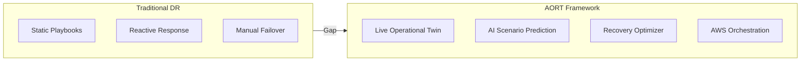

# Novelty Summary — AORT

> **Limit:** One page summary as per BCSE355L Phase-I guidelines

## What Makes AORT Different?

AORT does **not** treat digital twin modeling, banking risk prediction, business continuity, or AWS disaster recovery as separate concerns. It combines them into a **single predictive, decision-oriented framework** for banking infrastructure resilience on AWS.

---

## Novelty Dimensions

| Dimension | Existing Work | AORT Contribution |
|-----------|---------------|-------------------|
| **New Feature** | Reactive monitoring or static DR playbooks | **Predictive recovery planning** with scenario simulation before incidents |
| **Better Algorithm** | Fixed rule-based failover | **AI-based ranking** of multiple recovery options with learning feedback |
| **Better Architecture** | Siloed risk, ERP, or cloud layers | **Layered operational twin** unifying infrastructure state, operational behavior, and policy constraints |
| **Better AWS Integration** | Generic cloud guidance | **Direct use** of AWS resilience patterns, observability inputs, EDR, Step Functions |
| **Better Security** | Partial cyber/continuity coverage | Explicit **ransomware, compliance, auditability**, and banking continuity integration |
| **Better Automation** | Manual DR execution | Framework **simulates, compares, and recommends** recovery actions with approval gates |
| **Better Accuracy** | Static RTO/RPO assumptions | Decisions guided by **live telemetry** and scenario simulation |
| **Better Scalability** | Single-service or on-prem focus | **Cloud-scale** banking workloads and multi-service ERP environments |

---

## One-Line Novelty Statement

> AORT introduces an **AWS-native predictive disaster recovery planning framework** for banking infrastructure that uses digital twin simulation, AI-based disruption prediction, multi-hazard scenario analysis, and recovery strategy optimization to transform disaster recovery from a **reactive process** into a **predictive, automated, and resilience-oriented system**.

---

## Comparison Diagram

## Thesis Positioning

AORT is **not** merely another banking digital twin, and **not** just another AWS DR architecture study. It is a **decision-centric operational twin** that transforms resilience guidance and simulation outputs into ranked, explainable recovery actions for regulated banking systems.
