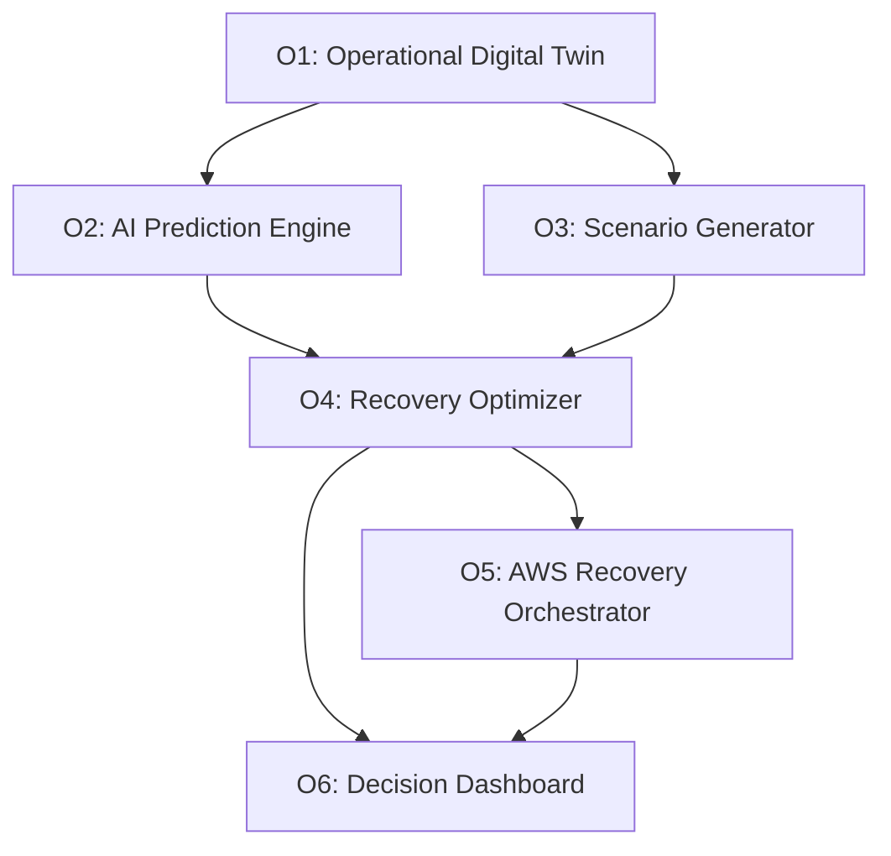

# Project Objectives — AORT

> **Course:** BCSE355L — Cloud Architecture Design (Phase-I)  
> Objectives are measurable and achievable within an academic cloud architecture project.

## Primary Objectives

| # | Objective | Success Metric |
|---|-----------|----------------|
| **O1** | Develop an AWS-based operational digital twin that mirrors banking infrastructure, ERP services, and dependencies in near real time | Twin synchronizes telemetry from ≥5 AWS/ERP sources with <5 min staleness (simulated) |
| **O2** | Build an AI prediction module that identifies failure patterns and forecasts disruption using cloud telemetry and operational logs | Model detects ≥3 anomaly classes with documented precision/recall targets |
| **O3** | Simulate at least five banking-relevant disaster scenarios: ransomware, server failure, network outage, regional failure, and transaction surge | Scenario generator produces reproducible disruption profiles per hazard type |
| **O4** | Evaluate and rank multiple recovery strategies using RTO, RPO, cost, service availability, and business continuity impact | Optimizer scores ≥3 candidate DR plans per scenario with explainable ranking |
| **O5** | Integrate AWS-native recovery mechanisms so the framework recommends or automates failover and restoration actions | Recommendations map to AWS patterns: EDR, multi-region failover, Step Functions orchestration |
| **O6** | Visualize resilience metrics, predicted failure impact, and recommended recovery actions through a decision dashboard | Dashboard displays twin status, scenarios, rankings, and approval workflow |

---

## Objective Dependency Graph

---

## Alignment with AORT Modules

| Objective | Module |
|-----------|--------|
| O1 | Telemetry Collector + Operational Digital Twin |
| O2 | AI Prediction Engine |
| O3 | Multi-Hazard Scenario Simulator |
| O4 | Recovery Strategy Ranking Module |
| O5 | AWS Recovery Orchestrator |
| O6 | Dashboard and Decision Console |

## Phase-I vs Phase-II

| Phase | Scope |
|-------|-------|
| **Phase-I (Current)** | Architecture, literature, objectives, dataset planning, documentation |
| **Phase-II (Future)** | Implementation and evaluation of O1–O6 |
