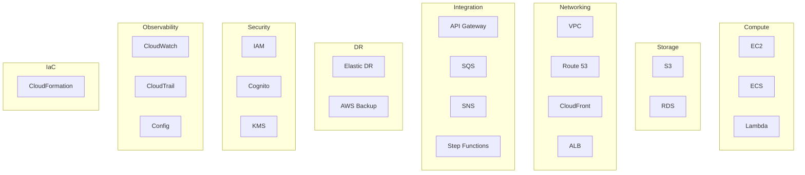

# AWS Services Planning Table — AORT

> Complete mapping of planned AWS services for Phase-II implementation

| AWS Service | Purpose | Reason for Selection | Inputs | Outputs | Example Use in AORT |
|-------------|---------|---------------------|--------|---------|---------------------|
| **Amazon EC2** | Host ERP simulator and twin worker nodes | Flexible compute for persistent twin workloads | AMI, instance type, VPC config | Running instances with ERP/twin services | Run banking ERP simulator mirroring production topology |
| **Amazon ECS** | Containerized Digital Twin Engine | Scalable, managed container orchestration | Task definitions, Docker images | Running twin engine containers | Deploy Operational Digital Twin as ECS service |
| **AWS Lambda** | Telemetry processing and event-driven tasks | Serverless, cost-efficient for burst telemetry | CloudWatch events, SQS messages | Processed telemetry records | Normalize CloudWatch metrics into twin events |
| **Amazon API Gateway** | REST API for dashboard and twin services | Managed API layer with throttling and auth | HTTP requests | API responses | Expose twin status and recovery recommendation APIs |
| **Amazon RDS** | ERP metadata and twin state storage | Relational model for dependencies and state | SQL queries, connection strings | Structured twin state, ERP records | Store dependency graph and service health state |
| **Amazon S3** | Log storage, model artifacts, backups | Durable, scalable object storage | Objects, buckets | Stored files, versioned backups | Archive CloudTrail logs and recovery reports |
| **Amazon CloudWatch** | Application and infrastructure monitoring | Native AWS observability | Metrics, logs, alarms | Dashboards, alarms, metric streams | Monitor twin engine health and ERP simulator metrics |
| **AWS CloudTrail** | API audit and security logging | Compliance and forensic analysis | AWS API calls | Audit log files | Track configuration changes during insider-threat scenarios |
| **AWS Config** | Configuration compliance tracking | Detect config drift for disaster scenarios | Resource configurations | Compliance snapshots | Identify unauthorized security group changes |
| **AWS IAM** | Authentication and authorization | Fine-grained access control | Policies, roles, users | Access decisions | Restrict recovery orchestration to authorized administrators |
| **Amazon Cognito** | User authentication for dashboard | Managed user pools for web apps | Credentials, tokens | JWT tokens | Authenticate banking DR administrators |
| **Amazon SNS** | Alert notifications | Multi-channel alerting | Messages, topics | Email/SMS/push notifications | Alert admin when failure predicted or recovery completes |
| **Amazon SQS** | Telemetry message queue | Decouple ingestion from processing | Messages | Consumed messages | Buffer telemetry between collector and twin engine |
| **AWS Step Functions** | Recovery workflow orchestration | Visual, auditable state machines | Recovery plan JSON | Workflow execution status | Orchestrate multi-step failover and restore workflows |
| **AWS Elastic Disaster Recovery** | Cross-region disaster recovery | Low RPO block-level replication | Source servers | Recovery instances in DR region | Failover ERP database server during regional outage |
| **AWS Backup** | Centralized backup management | Unified backup policies across services | Backup plans, vaults | Recovery points | Schedule RDS and EBS backups for RPO compliance |
| **Amazon Route 53** | DNS routing and health checks | Traffic management and failover | DNS records, health checks | Routed traffic | Failover dashboard and API traffic to DR region |
| **Amazon CloudFront** | CDN for dashboard delivery | Low-latency global content delivery | Static/dynamic content | Cached responses | Serve decision dashboard with TLS termination |
| **Application Load Balancer** | Load balancing for web services | Layer 7 routing and health checks | HTTP/HTTPS traffic | Balanced requests | Distribute dashboard traffic across ECS tasks |
| **AWS KMS** | Encryption key management | Regulatory encryption requirements | Keys, policies | Encrypted data | Encrypt RDS and S3 data at rest |
| **AWS CloudFormation** | Infrastructure as Code | Reproducible, versioned infrastructure | Templates | Deployed stacks | Provision entire AORT VPC and service stack |
| **Amazon VPC** | Network isolation | Security boundary for banking workloads | Subnets, route tables, NACLs | Isolated network | Separate public/private subnets for twin and ERP |
| **Amazon SageMaker** *(Phase-II)* | ML model training and deployment | Managed ML for prediction engine | Training data, algorithms | Deployed endpoints | Train disruption propagation prediction model |
| **Amazon QuickSight** *(Phase-II)* | Advanced analytics visualization | Managed BI dashboards | Data sources | Interactive dashboards | Visualize resilience trends and recovery performance |

---

## Service Category Diagram

