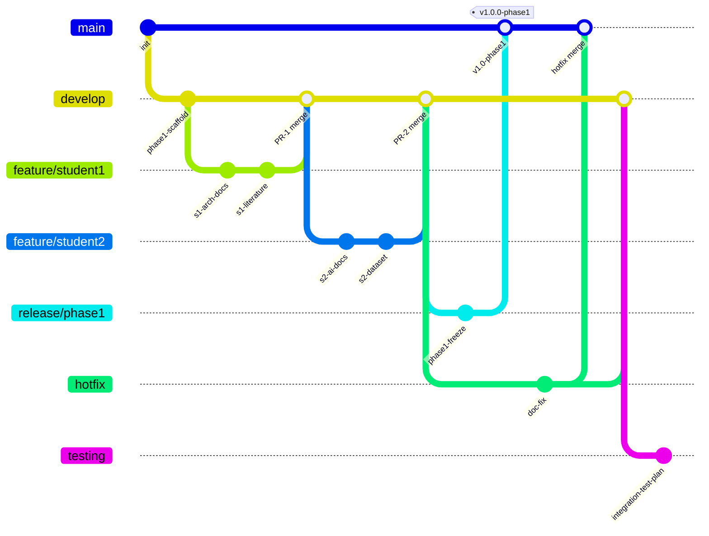
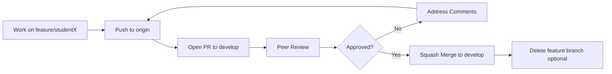
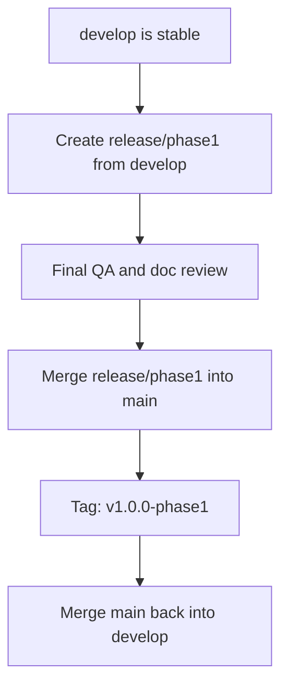

# Git Branch Strategy & Workflow

> **Repository:** AORT_Cloud_Project_2026  
> **Team Size:** 2 students

## Branch Hierarchy



---

## Branch Purposes

| Branch | Purpose | Merge Target | Protection |
|--------|---------|--------------|------------|
| `main` | Production-ready, tagged releases only | — | Protected; PR + review required |
| `develop` | Integration branch for all approved features | `main` (via release) | Protected; PR required |
| `feature/student1` | Student 1 isolated work (AWS, twin, docs 1–8) | `develop` | None |
| `feature/student2` | Student 2 isolated work (AI, dataset, docs 9–15) | `develop` | None |
| `testing` | Integration and test plan validation | `develop` | None |
| `release/phase1` | Phase-I submission freeze and final QA | `main` | Protected during release |
| `hotfix` | Urgent documentation or config fixes | `main` + `develop` | PR required |

---

## Merge Strategy

| Flow | Strategy | Rationale |
|------|----------|-----------|
| `feature/*` → `develop` | **Squash merge** | Clean history; one commit per feature/PR |
| `develop` → `release/*` | **Merge commit** | Preserve integration history for release audit |
| `release/*` → `main` | **Merge commit** | Tagged release point |
| `hotfix` → `main` + `develop` | **Cherry-pick or merge** | Ensure fix propagates to both branches |

---

## Pull Request Flow



### PR Checklist
- [ ] Descriptive title following commit conventions
- [ ] Linked milestone or issue
- [ ] No secrets or credentials
- [ ] Markdown renders correctly
- [ ] One reviewer approval minimum

---

## Review Process

1. Author opens PR with summary and scope
2. Reviewer checks content accuracy, formatting, and guideline compliance
3. Reviewer leaves comments or approves
4. Author resolves comments
5. Squash-merge after approval
6. Author updates `docs/weekly-progress/` if applicable

---

## Release Process



---

## Tagging Strategy

| Tag Format | Example | When |
|------------|---------|------|
| `v{major}.{minor}.{patch}-phase{N}` | `v1.0.0-phase1` | Phase-I submission |
| `v{major}.{minor}.{patch}` | `v1.1.0` | Phase-II milestones |
| `v{major}.{minor}.{patch}-rc{N}` | `v2.0.0-rc1` | Release candidates |

---

## Naming Conventions

| Item | Convention | Example |
|------|------------|---------|
| Feature branch | `feature/student{N}` or `feature/{short-desc}` | `feature/student1` |
| Release branch | `release/{phase or version}` | `release/phase1` |
| Hotfix branch | `hotfix/{issue-id}-{short-desc}` | `hotfix/12-readme-typo` |
| Tags | Semantic versioning | `v1.0.0-phase1` |
| Commits | Conventional Commits | `docs(arch): add AWS VPC diagram` |

---

## Commit Message Conventions

```
<type>(<scope>): <description>

[optional body]

[optional footer]
```

**Types:** `feat`, `fix`, `docs`, `arch`, `test`, `chore`, `refactor`

**Scopes:** `literature`, `arch`, `dataset`, `ai`, `aws`, `github`, `readme`

---

## Contribution Matrix

| Activity | Student 1 | Student 2 |
|----------|:---------:|:---------:|
| Literature Survey (Papers 1–8 / 9–15) | ✓ (1–8) | ✓ (9–15) |
| Research Gap Analysis | ✓ | ✓ |
| AWS Architecture | ✓ | |
| System Architecture | ✓ | ✓ |
| Digital Twin Planning | ✓ | |
| AI / Recovery Optimizer Planning | | ✓ |
| Scenario Generator Planning | | ✓ |
| Dataset Documentation | | ✓ |
| Frontend Planning | ✓ | |
| Backend Planning | | ✓ |
| Testing Planning | | ✓ |
| GitHub Setup & Branch Strategy | ✓ | |
| Documentation | ✓ | ✓ |
| Presentation | ✓ | ✓ |
| GitHub Commits (20–30 each) | ✓ | ✓ |
| Pull Requests (≥2 each) | ✓ | ✓ |
| Code Review Participation | ✓ | ✓ |

---

## Expected GitHub Activity (Per Student)

- **20–30** meaningful commits
- **≥2** Pull Requests
- Active review participation
- Weekly commits with progress documentation
